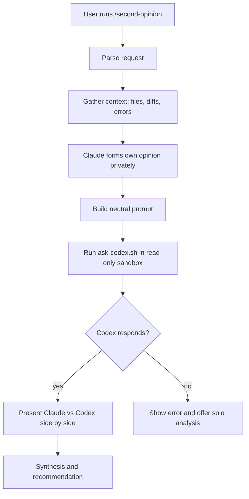

# Second Opinion

A Claude Code skill that asks OpenAI Codex for an independent second opinion on technical questions, design decisions, code reviews, or debugging.

## Usage

```
/second-opinion [question or topic]
```

Claude forms its own opinion first, then calls Codex (read-only), and presents both analyses side-by-side with a synthesis.

## Flow



## Requirements

- [`codex-cli`](https://github.com/openai/codex) installed and authenticated:
  ```bash
  npm install -g @openai/codex
  codex login
  ```

## Layout

- `SKILL.md` — skill definition and workflow
- `scripts/ask-codex.sh` — invokes Codex in `--sandbox read-only`
- `references/` — prompting guidance
